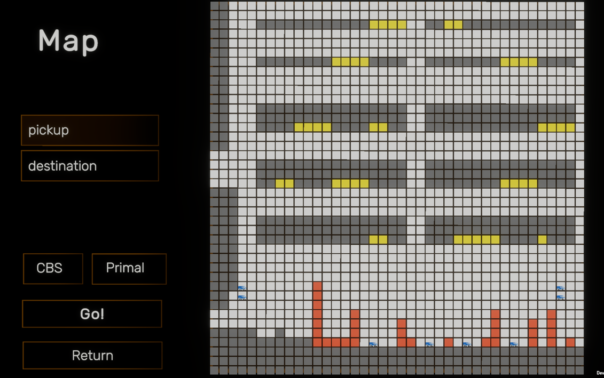
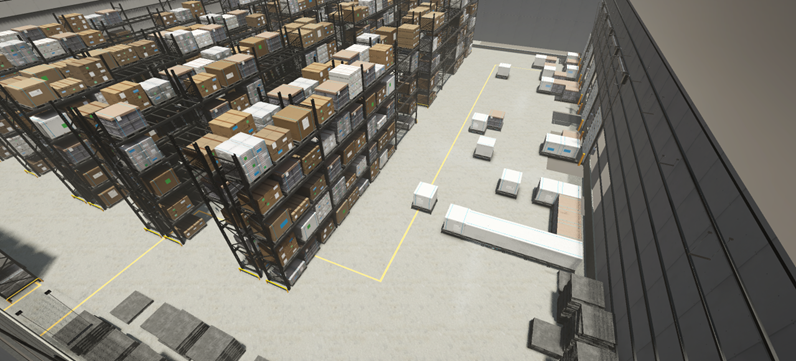
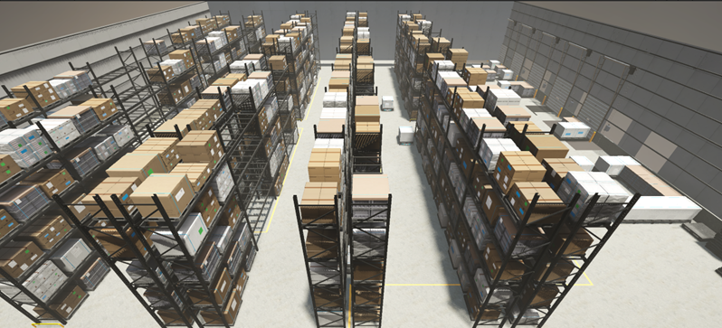
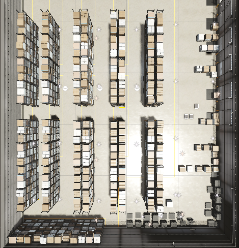
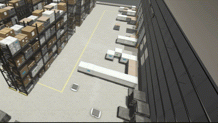

# Multi-Agent Path Planning — 3D Warehouse Application

## 🚀 Project Overview

This project implements **multi-agent path planning (MAPF)** algorithms for intelligent 3D warehouse applications. It simulates autonomous vehicles (AGVs) performing **cargo pickup, delivery, and unloading** tasks in a warehouse, supporting **user interaction** and **realistic warehouse modeling**.

Key features include:

- **CBS and PRIMAL MAPF algorithms** for path planning
- **Interactive control UI** to set pickup/delivery tasks and select algorithms
- **3D warehouse simulation** with racks, goods, and vehicles
- **Multi-view visualization** and **AGV animations**

------

## 🖥️ Interactive Control

A complete UI allows users to:

- Load warehouse maps and initial AGV positions
- Select pickup and drop-off locations (including shelf levels)
- Choose the planning algorithm (CBS or PRIMAL)

------

## 🏭 Warehouse Simulation

The 3D warehouse environment includes **AGVs, racks, goods, and obstacles**. Multiple camera views are available, switchable via keyboard.

------

## 🎬 AGV Animations

The simulation supports dynamic AGV actions:

- **Movement**
  
   

- **Pickup**
  
   

- **Unload**
  
   

------

## 🧩 MAPF Algorithms

### 1. CBS (Conflict-Based Search)

- **Type:** Centralized
- **Idea:** Plans individual paths for each agent, then resolves conflicts recursively via high-level search constraints.
- **Strengths:** Produces high-quality, often optimal paths for small-to-medium numbers of agents.
- **Limitations:** Computational cost grows quickly with more agents or complex environments.

**Reference:**
 Sturtevant, Nathan R., et al. *Conflict-based search for optimal multi-agent pathfinding*. Artificial Intelligence, 2015.

------

### 2. PRIMAL

- **Type:** Decentralized, learning-based
- **Idea:** Agents learn policies via **reinforcement learning** and **imitation learning**, making local decisions within a limited **field of view** (e.g., 10×10 grid).
- **Strengths:** Highly scalable; better suited for larger teams or dynamic environments.
- **Limitations:** Sensitive to deadlocks or agent wandering; requires careful training for stability.

**Reference:**
 G. Sartoretti et al., "PRIMAL: Pathfinding via Reinforcement and Imitation Multi-Agent Learning," in IEEE Robotics and Automation Letters, vol. 4, no. 3, pp. 2378-2385, July 2019, doi: 10.1109/LRA.2019.2903261.

------

## 📦 Workflow Overview

**1. UI Initialization**

- Use the UI control panel to customize a **warehouse map**.
- The map configuration is saved in `input.yaml`.

**2. Algorithm Execution**

- The Python program reads `input.yaml` and runs the **MAPF algorithm** to generate collision-free paths for all agents.

**3. Result Calculation**

- The computed paths are saved to `output.yaml` for Unity to read.

**4. Path Loading**

- Unity converts the 2D path coordinates into **3D positions**.
- Paths are assigned to corresponding agents for execution.

**5. Task Update**

- For cooperative tasks (e.g., transporting goods), when an agent reaches a pickup location, the system **updates `input.yaml`** and recomputes paths for all agents.

**6. Goal Completion**

- Steps in **Task Update** are repeated until **all agents finish their delivery tasks**.

## ⚙️ Usage

1. **Dependencies**
   - `cbs_requirements.txt` – Python environment dependencies for running **CBS** algorithm.
   - `primal_requirements.txt` – Python environment dependencies for running **PRIMAL** algorithm.
2. **Project Files**
   - `Assets/` – Unity project files, requires **Unity** to open and run.
3. **Running the System**
   - After setting up the Python environment and installing dependencies, run the algorithm to generate paths.
   - Open `Assets/` in Unity, load the paths, and simulate the multi-agent tasks.
